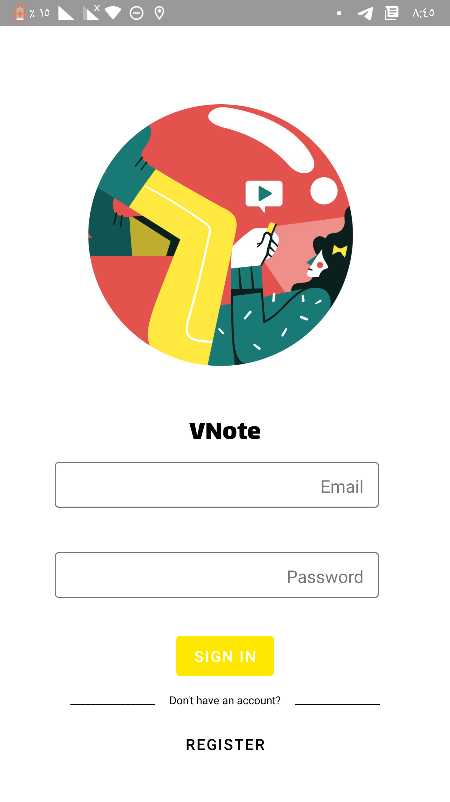
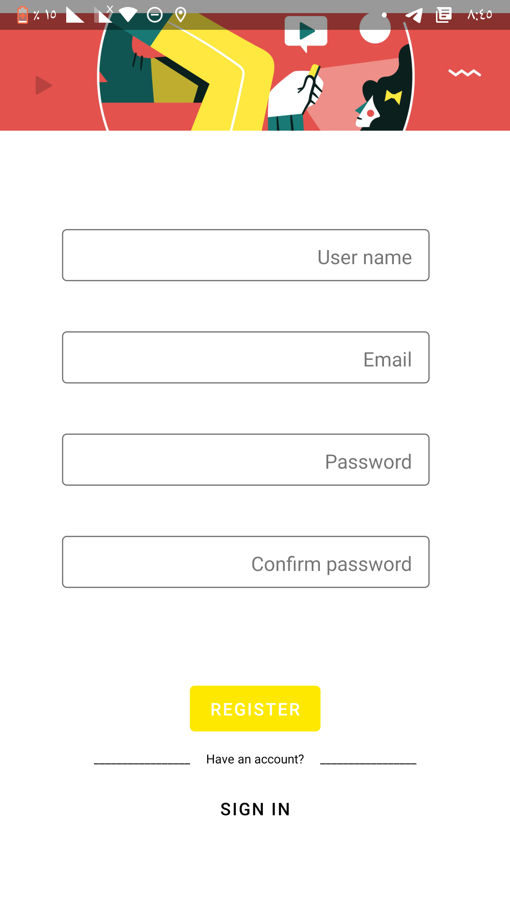
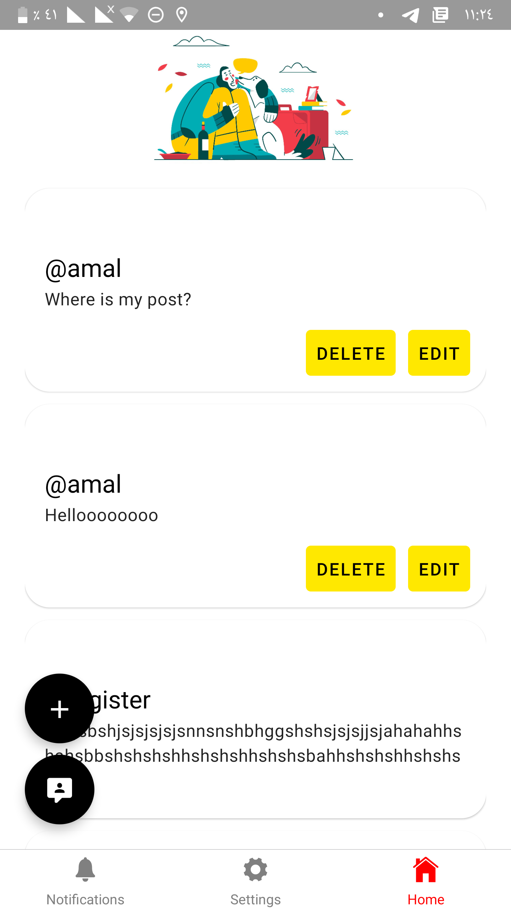
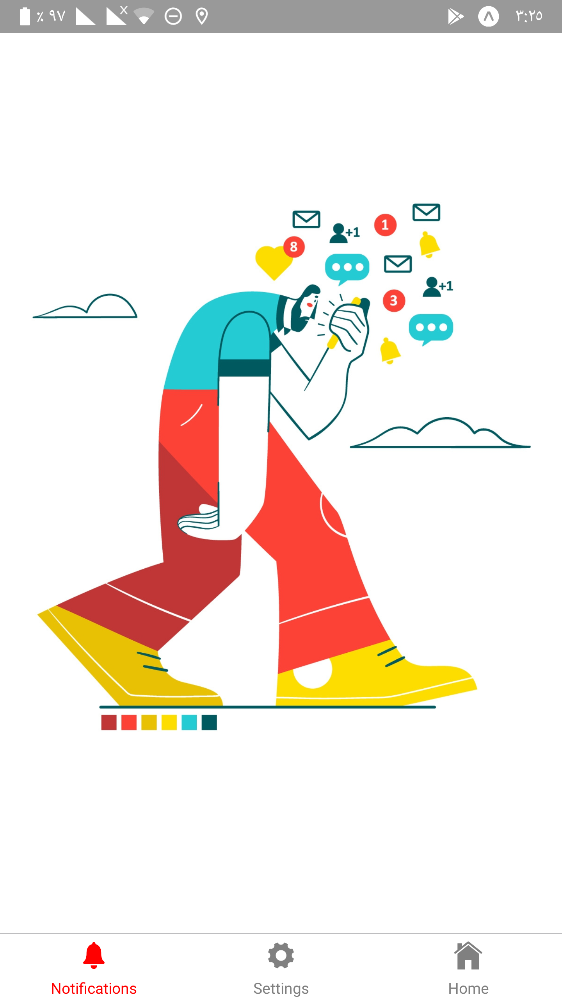

# VNote
## Description
VNote is a mobile app that allows users to create virtual sticky notes attached to their current location on the map. By attaching notes to locations, the app is meant to capture the overall atmosphere of places and what people think, feel and experience when they are at a specific location. Whenever a user creates a new note, that note is attached to the location where it was created. The note can only be viewed within a 10 meters range of where it was created.
Additionally, the app allows the user to leave notes for other users in specific locations. The recipient user will only be notified about that note once they enter the note’s range. For example, you can leave a note for your friend at their favorite café so the next time they visit the place they would be notified of the note you left for them at that location. This serves as a cute way of leaving messages to people but could also be expanded for advertisement and commercial use. 
# App Screenshots
#### Disclaimer: 
All illustrations used in this app belong to [Gaspart](https://dribbble.com/Gaspart) on dribbble.



### Technical Used

```
Frontend:
- React Native
- Expo
- Redux
- React Native Paper
- socket.io-client

Backend:
- Node.js
- Express
- MongoDB
- socket.io
- Passport
- Jsonwebtoken
- bcrybt
```

# Use & Installation
For the time being, VNote is only available through the Expo app. To view it, download Expo from google store or apple store and scan the QR Code available at this link https://expo.io/@amal_nj/VNote  and make sure to enable location services. I’m currently working on making it a standalone app which will be available in google store.

# Links
[Backend repository](https://github.com/amal-nj/VNote-Backend)
[Backend deployed site](https://vnote-api.herokuapp.com)
